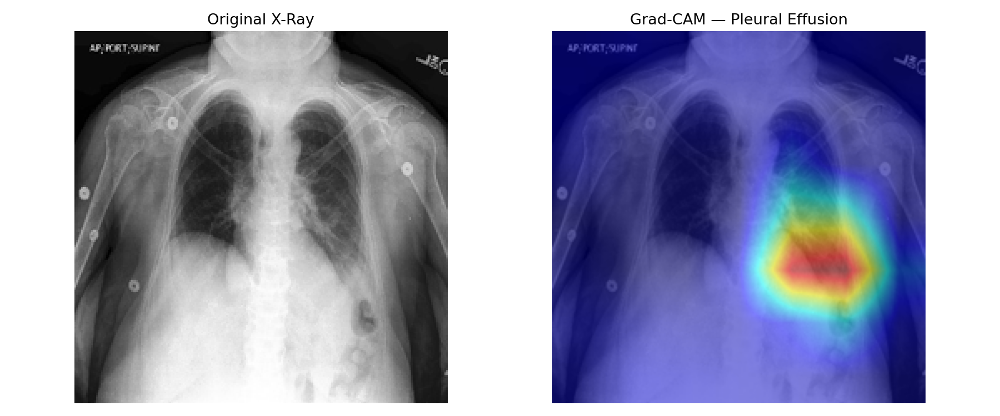
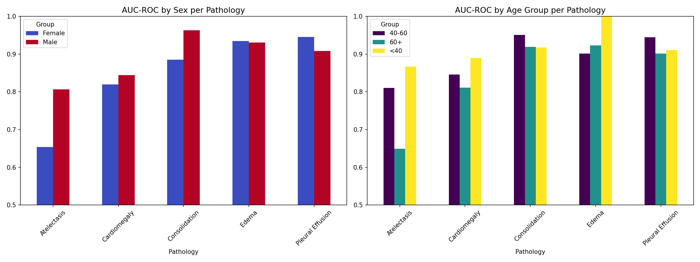

# Chest Pathology Detection with Interpretability & Fairness Analysis

> A production-oriented medical imaging project built on CheXpert (Stanford) —
> going beyond classification to address clinical interpretability, demographic fairness,
> and responsible deployment.

---

## Motivation

After 10 years building ML systems in production — fraud detection, anomaly detection,
computer vision — I wanted to apply that experience to a domain where model decisions
genuinely matter. This project is my first step into clinical AI, and I built it to
reflect how I think a responsible medical ML system should be documented and evaluated.

---

## What makes this different from a standard classifier

Most chest X-ray projects stop at AUC-ROC on a test set. This one goes further:

- **Grad-CAM interpretability** — visualizing which regions of the X-ray drive each prediction,
  because a clinician needs to know *where* the model is looking, not just *what* it predicts
- **Fairness analysis** — AUC-ROC broken down by sex and age group for each pathology,
  because a model that works well on average can still fail specific patient populations
- **Clinical limitations document** — an honest assessment of what this model cannot do,
  written as if presenting to a clinical team before a pilot

---

## Dataset

**CheXpert-v1.0-small** — Stanford Machine Learning Group  
224,316 chest X-rays · 65,240 patients · 5 pathologies  
See [data/README.md](data/README.md) for download instructions.

Pathologies: `Atelectasis` · `Cardiomegaly` · `Consolidation` · `Edema` · `Pleural Effusion`

---

## Technical Stack

| Component | Technology |
|-----------|------------|
| Framework | PyTorch (MPS acceleration — Apple Silicon) |
| Model | EfficientNet-B0 fine-tuned from ImageNet |
| Interpretability | Grad-CAM (pytorch-grad-cam) |
| Fairness | Scikit-learn · Pandas |
| Visualization | Matplotlib · Seaborn |

---

## Results

### AUC-ROC by Pathology

| Pathology | AUC-ROC |
|-----------|---------|
| Atelectasis | 0.7419 |
| Cardiomegaly | 0.8387 |
| Consolidation | 0.9255 |
| Edema | 0.9316 |
| Pleural Effusion | 0.9204 |

### Fairness — AUC-ROC by Sex

---

## Project Structure

    chexpert-medical-ai/
    ├── notebooks/
    │   ├── 01_exploration.ipynb       — EDA + label analysis
    │   ├── 02_training.ipynb          — Model training
    │   ├── 03_interpretability.ipynb  — Grad-CAM visualizations
    │   └── 04_fairness.ipynb          — Bias analysis by age/sex
    ├── src/
    │   ├── dataset.py                 — PyTorch Dataset class
    │   ├── model.py                   — EfficientNet fine-tuning
    │   ├── train.py                   — Training loop
    │   ├── evaluate.py                — Metrics
    │   └── gradcam.py                 — Grad-CAM utilities
    └── docs/
        └── clinical_limitations.md    — Responsible deployment notes

---

## How to Run

    # 1. Clone the repository
    git clone https://github.com/your-username/chexpert-medical-ai.git
    cd chexpert-medical-ai

    # 2. Install dependencies
    pip install -r requirements.txt

    # 3. Download CheXpert — see data/README.md

    # 4. Train the model
    python src/train.py

    # 5. Open notebooks in order
    jupyter notebook

---

## Clinical Limitations

This is a research prototype, not a clinical tool.  
See [docs/clinical_limitations.md](docs/clinical_limitations.md) for a full assessment
including label quality, distribution shift, fairness gaps, and regulatory context.

---

## Author

**Luiggi Ramón Méndez Mora**  
Senior Data Scientist with 10 years of production ML experience, transitioning into AI for healthcare.  
[LinkedIn](https://linkedin.com/in/luiggilink) · [Email](mailto:luiggi.mendezmora@gmail.com) · [Medium](https://medium.com/@luiggilink)
